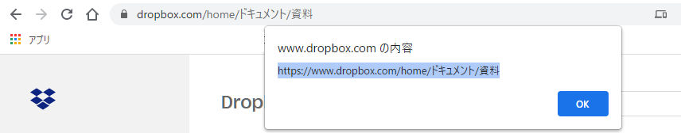
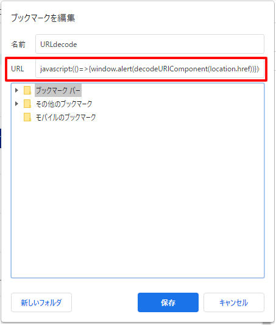

# decodeURI bookmarklet

- [decodeURI bookmarklet](#decodeuri-bookmarklet)
  - [Introduction](#introduction)
  - [設定方法](#設定方法)
  - [使用方法](#使用方法)
  - [処理内容と注意事項](#処理内容と注意事項)

---

## Introduction
日本語を含むURLを、URL欄上に見え方のままコピー&ペーストするための補助ツール

日本語を含むURLをブラウザのURL欄からそのままコピー&ペーストすると…、こんなことが起きませんか？

- URL欄上：
```https://www.dropbox.com/home/ドキュメント/資料```
- コピー&ペースト結果：
```https://www.dropbox.com/home/%E3%83%89%E3%82%AD%E3%83%A5%E3%83%A1%E3%83%B3%E3%83%88/%E8%B3%87%E6%96%99```

画面上の日本語表記は、ブラウザ上 実際にはエンコーディングされた非常に長く人が読めない形で利用されているため、単純にコピペすると、エンコーディングされた文字列が取得されてしまうわけです。

メール等にURLを貼る際、日本語のまま(エンコーディングされていない形)のURLがほしい、と思い、現在ページのURLをデコードして、コピー&ペーストできるようにする簡易ツール(bookmarklet)を作ってみました。



## 設定方法
1. ブラウザのブックマーク追加画面を開く
2. URL欄に、decodeURI.js のコードを貼り付けて、ブックマーク追加する（名前は任意の名前を）
3. 完了

    


## 使用方法
1. URLをコピーしたいページを開く
2. decodeURI.js を設定したブックマークをクリックする
3. popup画面が立ち上がり、URLが表示される
4. コピーする
5. 「OK」でpopupを閉じる
6. 好きなところにペーストする
   

## 処理内容と注意事項
当ツールは、ブックマークレットとして、下記javascriptを実行しています。
- location.href
  - 現在ページのURLを取得
- decodeURIComponent()
  - 文字列をURIデコードする
- window.alert()
  - ブラウザpopupを表示


（何も起きないと思いますが）本ツールの使用によるいかなる損害に対しても一切責任は負いません（念のため）。